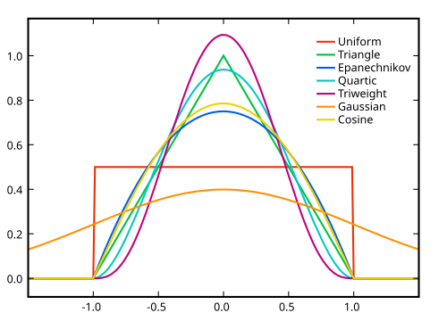

```{r setup, include=FALSE}
knitr::opts_chunk$set(echo = TRUE)
```

## 1 Introducción 

En ocasiones, en las redes es de mayor interés los **atributos nodales**, en lugar de las relaciones. Así, es razonable pensar que estos atributos **se ven influenciados por las conexiones en la red**. Por ejemplo:

- Los comportamientos y creencias de las personas pueden verse influenciados por sus interacciones.
- Una persona que suele tratar con enfermos puede tender a enfermarse más frecuentemente.

Estos **atributos** asociados con tales fenómenos pueden ser tratados como **procesos estocásticos** definidos en la red como una colección de variables aleatorias \(\vec{X}\) que están indexadas por el grafo \( G = (V, E) \), es decir:

- \( \{X_i\} \) para \( i \in V \).
- \( \{X_i(t)\} \), con \( t \) variando en el tiempo.

A \( \{X_i\} \) se le conoce como un **proceso estático** y a \( \{X_i(t)\} \) como un **proceso dinámico**. En este cuaderno se considerará \(\vec{X}\) como un **vector binario** cuyo valor será \textbf{1} si el nodo presenta el **atributo de interés** y \textbf{0} si el nodo no presenta el atributo de interés.

## 2 Método del vecino más cercano 

La **predicción del vecino más cercano** consiste en considerar una **colección de atributos nodales** \( \{X_i\} \) que no dependen del tiempo, y hacer predicciones locales para un vértice \( i \in V \) encontrando el **promedio del vecino más cercano**:

\[
\frac{\sum_{j \in \mathcal{N}_i} x_j}{|\mathcal{N}_i|},
\]

* \( \mathcal{N}_i \) es la vecindad de \( i \) en \( G \).
* \( |\mathcal{N}_i| \) es el número de vecinos de \( i \) en \( G \).

Al momento de predecir \( \vec{X} \), usualmente se compara con un umbral de 0.5. Luego, si el **promedio de los vecinos más cercanos** es mayor a ese umbral, se dirá que la predicción \( X_i = 1 \).

## 2.1 Ejemplo red de proteínas y Método del vecino más cercano

Red de proteínas que pertenecen a la levadura de panadería **Saccharomyces cerevisiae**, reunidas por Jiang et al. de diversas fuentes con descripción de algunas funcionalidades y atributos de las proteínas. El atributo nodal *ICSC* es un vector binario que indica aquellas proteínas que tienen como **función "cascada de señalización intracelular"** (*ICSC*), una forma específica de comunicación celular.

```{r,results='hide'}
# semilla para garantizar reproducibilidad
set.seed(42)
# Importancion de la libreria sand y los datos ppi.CC
suppressMessages(suppressWarnings(library(sand)))
suppressMessages(data(ppi.CC))


```
```{r}
# resumen del objeto tipo igrap ppi.cc
summary(ppi.CC)
```
```{r}
# visualización de los 10 primeros valores del Vector ICSC
V(ppi.CC)$ICSC[1:10]
```

```{r}
# asignación de colores a las proteínas en base a su función 
 V(ppi.CC)[ICSC == 1]$color <- "yellow"
 V(ppi.CC)[ICSC == 0]$color <- "blue"
 # gráfico de la red de proteínas
plot(ppi.CC, vertex.size=5, vertex.label=NA)
```
```{r}
# cálculo del coeficiente de asortatividad 
assortativity_nominal(ppi.CC, as.numeric(as.factor(V(ppi.CC)$ICSC)), directed = FALSE)
```

```{r}
# componente gigante
clu <- components(ppi.CC)
# grafo de la componente gigante 
ppi.CC.gc <- induced_subgraph(ppi.CC, 
   clu$membership==which.max(clu$csize))
# cálculo promedio del vecino más cercano
nn.ave <- sapply(V(ppi.CC.gc),
   function(x) mean(V(ppi.CC.gc)[.nei(x)]$ICSC))

```

```{r}
par(mfrow=c(2,1))
# histogramas del promedio del vecino más cercano 
# amarillo presenta ICSC

hist(nn.ave[V(ppi.CC.gc)$ICSC == 1], col="yellow",
   ylim=c(0, 30), xlab="Proportion Neighbors w/ ICSC",
   main="Egos w/ ICSC")
# azul no presenta ICSC
hist(nn.ave[V(ppi.CC.gc)$ICSC == 0], col="blue",
   ylim=c(0, 30), xlab="Proportion Neighbors w/ ICSC",
   main="Egos w/out ICSC")
```

```{r}
# predicción del vecino más cercano
nn.pred <- as.numeric(nn.ave > 0.5)
# cálculo de la tasa de error
print(mean(as.numeric(nn.pred != V(ppi.CC.gc)$ICSC)))

```
```{r, include=FALSE}
# Importación de las librerías con la información actualizada

#install.packages('devtools')
#if (!requireNamespace("BiocManager", quietly = TRUE))
#   install.packages("BiocManager")
#BiocManager::install(update = FALSE)
#BiocManager::install(c("GOstats","GO.db"), update = FALSE)
#BiocManager::install("org.Sc.sgd.db")
suppressWarnings(library(GOstats))
suppressWarnings(library(GO.db))
suppressWarnings(library(org.Sc.sgd.db))
```

```{r}
# importación de los datos de las proteínas actualizadas
x <- as.list(org.Sc.sgdGO2ALLORFS)
current.icst <- x[names(x) == "GO:0035556"]
ev.code <- names(current.icst[[1]])
icst.ida <- current.icst[[1]][ev.code == "IDA"]

```
```{r}
# nombres de las proteínas que tienen ICSC en la componente gigante
orig.icsc <- V(ppi.CC.gc)[ICSC == 1]$name
```
```{r}
# nombres de todas las proteínas que contienen ICSC
candidates <- intersect(icst.ida, V(ppi.CC.gc)$name)
```
```{r}
# nombre de las proteínas nuevas que contienen ICSC
new.icsc <- setdiff(candidates, orig.icsc)
new.icsc
```

```{r}
# predicciones de las proteinas que antes no se sabia que tenian ICSC
nn.ave[V(ppi.CC.gc)$name %in% new.icsc]
```


El método del vecino más cercano puede generalizarse mediante la construcción de un modelo estadístico apropiado, lo que permitirá hacer predicciones más precisas. Este modelo puede incluir variables tanto endógenas como exógenas de la red.

## 3 Campos aleatorios de Markov

Sea \( G=(V,E) \) un grafo y \( \mathbf{X}=(X_1,X_2,\dots,X_{N_V})^T \) una colección de variables aleatorias definidas en \( V \). Se dirá que \( \mathbf{X} \) es un campo aleatorio de Markov en \( G \) si:

\[
\begin{align*}
&P(X=x) > 0 \text{ para todos los posibles valores de } x, \\
&P(X_i=x_i|X_{-i}=x_{-i}) = P(X_i=x_i|X_{\mathcal{N}_i}=x_{\mathcal{N}_i}),
\end{align*}
\]

donde \( X_{-i} = (X_1, X_2, \dots, X_{i-1}, X_{i+1}, \dots, X_{N_V}) \) y \( X_{\mathcal{N}_i} \) es el vector de todos los \( X_j \) para \( j \) en \( \mathcal{N}_i \). **El concepto de MRF puede verse como una generalización de una cadena de Markov.**

Una característica clave que facilita el uso práctico de los campos aleatorios de Markov es que su **distribución asociada** se puede expresar como:

\[
P(X=x) = \left(\frac{1}{\kappa}\right)\exp\left\{U(x)\right\},
\]

donde:

- \( U(\cdot) \) es conocida como función de energía.
- \(\kappa\) es la función partición.


La función \( U(\cdot) \) se puede expresar como 
\[
 U(x) = \sum_{\mathcal{C}  \in C} U_{\mathcal{C}}(x) 
\]


- con \(\mathcal{C} \) el conjunto de todos los clanes en \( G \).

lo que permite simplificar los cálculos si se tienen los siguientes supuestos:

- \( U_{\mathcal{C}}\) no depende de la posición del clan.
- clanes de tamaño limitado, por lo general uno y dos.

### 3.1 Modelos Auto Logísticos

Al hacer los siguientes supuestos:

- Solo los **clanes** \( c \in \mathcal{C} \) de **tamaño uno o dos** tienen funciones de energía \( U_c \) distintas de cero.
- Las **probabilidades condicionales** tienen una forma de la **familia exponencial**.

\[ U(x) = \sum_{i \in V} x_i H_i(x_i) + \sum_{\{i,j\} \in E} B_{ij} x_i x_j \]

Los modelos con esta función de energía son llamados **modelos auto** por Besag.

Ahora, si se supone que \( X_i \) es una variable binaria,

\[ U(x) = \sum_{i \in V} \alpha_i x_i + \sum_{\{i,j\} \in E} B_{ij} x_i x_j \]

El modelo MRF resultante es llamado modelo **autologístico** debido a que si se asume que \( \alpha_i \equiv \alpha \) y \( \beta_{ij} \equiv \beta \) la probabilidad condicional se puede expresar como:

\[ \log \left( \frac{P(X_i = 1 \mid X_{\mathcal{N}_i} = x_{\mathcal{N}_i})}{P(X_i = 0 \mid X_{\mathcal{N}_i} = x_{\mathcal{N}_i})} \right) = \log \left( \frac{P(X_i = 1 \mid X_{\mathcal{N}_i} = x_{\mathcal{N}_i})}{1 - P(X_i = 1 \mid X_{\mathcal{N}_i} = x_{\mathcal{N}_i})} \right) = \alpha + \beta \sum_{j \in \mathcal{N}_i} x_j \]


Si se desea incorporar variables exógenas el modelo se puede ver como: 

\[
\log \frac{\mathbb{P}_{\alpha,\beta} \left( X_i = 1 \mid \mathbf{X}_{\mathcal{N}_i} = \mathbf{x}_{\mathcal{N}_i}, \mathbf{Z}_i = \mathbf{z}_i \right)}{\mathbb{P}_{\alpha,\beta} \left( X_i = 0 \mid \mathbf{X}_{\mathcal{N}_i} = \mathbf{x}_{\mathcal{N}_i}, \mathbf{Z}_i = \mathbf{z}_i \right)} = \mathbf{z}_i^T \alpha + \beta \sum_{j \in \mathcal{N}_i} (x_j - \mu_j),
\]

\( \mu_j = \{1 + \exp(-\mathbf{z}_j^T \alpha)\}^{-1} \)  es el valor esperado de \( X_j \) bajo independencia, es decir, cuando \( \beta=0 \).

### 3.2 Estimación de los parámetros

A diferencia del método del vecino más cercano, para este modelo se necesita estimar algunos parámetros que, en este caso, para el modelo auto logístico son \( \alpha \) y \( \beta \).

Al estimar estos parámetros por el método de **máxima verosimilitud**, se obtiene que es el valor que maximiza la expresión:

\[ \alpha M_1(x) + \beta M_{11}(x) - \kappa(\alpha, \beta), \]

donde:

- \( M_1(x) \) es el número de vértices que tienen el atributo, es decir, la variable \( x_i = 1 \).
- \( M_{11}(x) \) es el doble del número de pares de vértices donde ambos tienen el atributo, en otras palabras, donde \( x_i = x_j = 1 \) para alguna arista \( (i, j) \in G \).
- \( \kappa(\alpha, \beta) \) es la función de partición.

La función \( \kappa \) hace que la **estimación sea muy demandante computacionalmente**, por lo tanto, esta maximización se hace mediante el **método denominado pseudo-máxima verosimilitud**, originalmente propuesto por Besag para el análisis de datos espaciales. Resultando en que la estimación de la pseudo-verosimilitud es el valor que maximiza la siguiente expresión:

\[ \alpha M_1(x) + \beta M_{11}(x) - \sum_{i=1}^{N_V} \log \left[ 1 + \exp\left( \alpha + \beta \sum_{j \in \mathcal{N}_i} x_j \right) \right]. \]


### 2.1 Ejemplo red de proteínas y Modelo Auto Logístico

```{r,include = T}
suppressMessages(suppressWarnings(library(ngspatial)))
```

```{r}
# se toman característica de la red asociadas con cada nodo
gene.motifs <- cbind(V(ppi.CC.gc)$IPR000198, # vectores binarios
                     V(ppi.CC.gc)$IPR000403,
                     V(ppi.CC.gc)$IPR001806,
                     V(ppi.CC.gc)$IPR001849,
                     V(ppi.CC.gc)$IPR002041,
                     V(ppi.CC.gc)$IPR003527)
# se asigna la correspondiente forma a un modelo mrf que tiene atributos nodales
formula <- X ~ gene.motifs
```
```{r}
# se asigna la correspondiente forma a un modelo mrf que no tiene atributos nodales
formula1 <- X~1
```
```{r}
# se toma el atributos nodal que se desea predecir
X <- V(ppi.CC.gc)$ICSC
# matriz de adyacencia
A <- as_adjacency_matrix(ppi.CC.gc, sparse=FALSE)
```
```{r}
# modelo autologistico sin atributos nodales
m1.mrf <- autologistic(formula1, A=A,
                       control=list(confint="none"))

```

```{r}
# estimaciones 
m1.mrf$coefficients
```

```{r}
# vector booleano que marca verdadero si se supera el umbral
mrf1.pred <- as.numeric((m1.mrf$fitted.values > 0.5))
```

```{r}
# cálculo de la tasa de error
mean(as.numeric(mrf1.pred != V(ppi.CC.gc)$ICSC))
```

```{r}
# predicciones de las proteinas que antes no se sabia que tenian ICSC
m1.mrf$fitted.values[V(ppi.CC.gc)$name %in% new.icsc]
```


```{r}
# modelo auto logístico con atributos nodales
m2.mrf <- autologistic(formula, A=A,
                       control=list(confint="none"))


```

```{r}
# estimaciones 
m2.mrf$coefficients
```

```{r}
# vector booleano que marca verdadero si se supera el umbral
# cálculo de la tasa de error
mrf.pred2 <- as.numeric((m2.mrf$fitted.values > 0.5))
mean(as.numeric(mrf.pred2 != V(ppi.CC.gc)$ICSC))
```

```{r}
# predicciones de las proteinas que antes no se sabia que tenian ICSC
m2.mrf$fitted.values[V(ppi.CC.gc)$name %in% new.icsc]
```
### 2.2 Bondad Y ajuste

Una de las maneras de evaluar la bondad de ajuste del modelo es mediante la simulación. Por lo tanto, dado un modelo MRF ajustado, se realiza simulación del proceso \( X_i \) a partir de este modelo. Luego se calculan varias estadísticas que resumen las características de estas realizaciones y se comparan los resultados con los datos originales.

```{r}
set.seed(42)  
# numero de intentos
ntrials <- 100
a1.mrf <- numeric(ntrials)
a2.mrf <- numeric(ntrials)
# intercepto
Z1 <- rep(1,length(X))
# matriz que tiene intercepto y atributos nodales
Z2 <- cbind(Z1, gene.motifs)
# simulación
for(i in 1:ntrials){
  # simular red unicamente con intercepto
  X1.mrf <- rautologistic(as.matrix(Z1), A=A,
                          theta=m1.mrf$coefficients)
  # simular red que tiene intercepto y atributos nodales
  X2.mrf<- rautologistic(as.matrix(Z2), A=A,
                         theta=m2.mrf$coefficients)
  #asortatividad 
  a1.mrf[i] <- assortativity(ppi.CC.gc, X1.mrf+1,
                             directed=FALSE)
  a2.mrf[i] <- assortativity(ppi.CC.gc, X2.mrf+1,
                             directed=FALSE)
}

```


```{r}
# asortatividad de la red original
assortativity(ppi.CC.gc, X+1, directed=FALSE)
```

```{r}
hist(x = a1.mrf, freq = FALSE, col = "gray95", border = "gray95", 
     xlab = 'Asortatividad', ylab = "Frecuencia", 
     main = paste('ppp =', mean(a1.mrf >= assortativity(ppi.CC.gc, X + 1, directed = FALSE))))

abline(v = mean( assortativity(ppi.CC.gc, X + 1, directed = FALSE)), col = 2, lty = 3)
```


```{r}
summary(a1.mrf)
```
```{r}
hist(x = a2.mrf, freq = FALSE, col = "gray95", border = "gray95", 
     xlab = 'Asortatividad', ylab = "Frecuencia", 
     main = paste('ppp =', mean(a2.mrf >= assortativity(ppi.CC.gc, X + 1, directed = FALSE))))

abline(v = mean( assortativity(ppi.CC.gc, X + 1, directed = FALSE)), col = 2, lty = 3)
```

```{r}
summary(a2.mrf)
```

## 3 Método Kernel

Los modelos probabilísticos que se acaban de utilizar se pueden complementar con algún método que **relacione los vértices y atributos mediante algún tipo de función**. Para la construcción más explícita, una buena idea es un enfoque basado en la regresión con el grafo. Sin embargo, los métodos clásicos de regresión, como los mínimos cuadrados, se utilizan para relacionar una variable respuesta y unas variables explicativas sobre un espacio euclidiano.

Así, una solución a este problema es aplicando **métodos kernel** que han demostrado ser útiles para extender el paradigma de regresión clásico a diversos entornos con datos no tradicionales. En el nivel más básico, estos métodos consisten en:

- Una noción generalizada de variables predictivas (codificadas en el llamado kernel o núcleo).
- Una regresión con una variable respuesta sobre los predictores generalizados utilizando una regresión penalizada.

### 3.1 Regresión Kernel

El modelo de **regresión kernel** simple se utiliza cuando la variable respuesta \( y \) es continua y solo hay una variable explicativa \( x \), también continua. Se supone que se observan \( n \) pares de datos \( (x_i, y_i) \) que provienen del siguiente modelo de regresión no paramétrico:

$$
y_i = m(x_i) + \epsilon_i
$$

- \( \epsilon_i \) son variables aleatorias independientes.
- \( m(x) \) es la función regresora sin forma especificada.

Una forma de definir \( m(x) \) es mediante una **función kernel** \( K \) que cumple las siguientes características:

- Es simétrica y no negativa.
- Continua.
- Decreciente en el intervalo \([0, \infty)\).
- Tiende a 0 cuando el argumento tiende a infinito.




Esta función le **"asigna pesos"** a las observaciones dependiendo de la **distancia de \( x_i \)** al punto \( t \) donde se realiza la estimación \( (x_i, y_i) \) al ser evaluado en cualquier \( t \) de la variable explicativa.

El peso de \( (x_i, y_i) \) en la estimación de \( m(t) \) será:

$$
\omega_i = \omega(t, x_i) = \frac{K\left(\frac{x_i - t}{h}\right)}{\sum_{j=1}^n K\left(\frac{x_j - t}{h}\right)}
$$

- \( h \) es un parámetro de escala.

Una vez determinados los pesos \( \omega_i \), se resuelve el problema de mínimos cuadrados ponderados:

$$
\underset{\beta_0, \beta_1}{\text{arg min}} \sum_{i=1}^n \omega_i \left( y_i - (\beta_0 + \beta_1 (x_i - t)) \right)^2
$$

La recta de regresión ajustada localmente alrededor de \( t \) es:

$$
l_t(x) = \beta_0 + \beta_1 (x - t)
$$

y la estimación de la función de regresión en el punto \( t \) es el valor que toma esta recta en \( x = t \):

$$
\hat{m}(t) = l_t(t) = \beta_0
$$

Para **extender la regresión kernel al caso en el que hay \( p \) regresores**, es directo:

$$
y_i = m(x_{i1}, \dots, x_{ip}) + \epsilon_i
$$

Ahora, para definir la **función de regresión, se necesita definir los pesos de cada \( \omega_i \) de cada observación**.

La definición de los pesos \( \omega_i \) debe seguir la **misma lógica que en el caso univariado**, extendiendo la noción de **distancia al caso multivariado, mediante la creación de una matriz de similitud**.

Una forma sencilla de asignar pesos \( \omega_i \) que da buenos resultados en la práctica es la siguiente:

$$
\omega_i = \omega(t, x_i) \propto \prod_{j=1}^p K\left(\frac{x_{ij} - t_j}{h_j}\right)
$$

donde \( K \) es un kernel univariado.


Siguiendo un procedimiento análogo a la regresión kernel univariada, se obtienen los vectores \( Y = (y_1, \ldots, y_n)^T \), \( \varepsilon = (\varepsilon_1, \ldots, \varepsilon_n)^T \), \( \beta = (\beta_0, \ldots, \beta_p)^T \). Se define la matriz de pesos:

\[ W_t = \text{Diag}(w(x_1, t), \ldots, w(x_n, t)). \]

Ajustamos el modelo

\[ Y = X \beta + \varepsilon \]

por mínimos cuadrados ponderados :

\[ \hat{\beta} = \arg \min_{\beta \in \mathbb{R}^{p+1}} (Y - X_t \beta)^T W_t (Y - X_t \beta). \]

La solución es

\[ \hat{\beta} = \left( X_t^T W_t X_t \right)^{-1} X_t^T W_t Y. \]

La estimacion en el punto $t$, siguiendo la idea del caso univariado es 

\[\hat{m}(t)=\hat{m}(t_1,\dots,t_p)=\beta_0\]

### 3.1 Diseño de kernels en grafos
El diseño del kernel en grafos debe describir la similitud entre los vértices en el grafo \( G \), así la función Kernel \( K \)  

- \[ K: V \times V \to \mathbb{R} \] 

- para cada \( m = 1, \ldots, N_v \) y subconjunto de vértices \( \{i_1, \ldots, i_m\} \in V \), la matriz \( m \times m \) 
\[
\mathbf{K}^{(m)} = [K(i_j, i_{j'})]
\]

es simétrica y semidefinida positiva.

Aunque la proximidad de los vértices está codificada en la matriz de adyacencia \( A \), es más común ver el grafo laplaciano *L* usado en la regresión kernel.

-  \( L=D-A \) donde \( D \) es una matriz diagonal

Recordando que el laplaciano se define como \( L=D-A \) donde \( D \) es una matriz diagonal. El kernel laplaciano se define como la inversa generalizada de \( L \), es decir \( K=L^{-1} \).

Así, \( L=\Phi\Gamma\Phi^T \), donde \( \Phi \) es una matriz diagonal y \( \Gamma=diag(\gamma_i) \) ortogonal que se obtiene de la descomposición espectral de \( L \). Entonces, la inversa generalizada de esta está dada por 

\[ L^- = \sum_{i=1}^{N_v} f(\gamma_i) \phi_i \phi_i^T \]

donde \( \phi_i \) es la \( i \)-ésima columna de \( \Phi \) y 

\[ f(\gamma) = \begin{cases}
\gamma^{-1} & \text{si } \gamma \neq 0, \\
0 & \text{en otro caso.}
\end{cases} \]

### 3.3 Regresión del kernel en grafos.

Sea \( G = (V, E) \) un grafo y \( X = (X_1, \dots, X_{N_V}) \) un proceso sobre un atributo nodal y sea $V^_{obs}$ los nodos los cuales se conoce su atributo, con $n=|V^{obs}|$. Desde la perspectiva de la regresión Kernel, el objetivo es aprender de los datos sobre una función apropiada \( \hat{h} \in \mathbb{R}^{N_V}\), que mapea de \( V \) a \( \mathbb{R} \), y que describa bien la manera en que los atributos varían entre los vértices. Más precisamente, dado un Kernel \( K = \phi \Delta \phi \), se busca encontrar una elección óptima de \( h \) dentro de la clase:

\[ 
\mathbb{H}_K = \{ h : h = \phi \beta \text{ tal que } \beta^T \Delta^{-1} \beta < \infty \} 
\]

cuando \( h \) es un vector de longitud \( |N_V| \).

Para elegir un elemento \( h \) apropiado en \( \mathbb{H}_K \), denominado \( \hat{h} \), se emplea una estrategia de regresión penalizada. Así, se obtiene que \( \hat{h} = \Phi \hat{\beta} \) minimizando con respecto a $\beta$:

\[ \min_{\beta} \left[\sum_{i \in V^{obs}} C(x_i; \hat{h}) + \lambda \beta^T \Delta^{-1} \beta\right]
\]

donde:

- \( V^{obs} \) son los vértices observados.
- \( C(x; h) = [\max(0, 1 - (2x - 1)h)]^2 \) o una función convexa que mida la *pérdida* de la predicción.
- \( \lambda \) controla la importancia de la penalización por la complejidad del modelo y normalmente se elige en función de los datos.

Esto es analogo a minimizar

\begin{equation}
\min_{\alpha} \left[ \sum_{i \in V_{\text{obs}}} C \left( x_i; \left( \mathbf{K}^{(n)} \alpha \right)_i \right) + \lambda \alpha^T \mathbf{K}^{(n)} \alpha \right].
\end{equation}
Si se asume que $C(x;a)=(x-a)^2$
\begin{equation}
\min_{\alpha} \left[ \left( \mathbf{x}^{\text{obs}} - \mathbf{K}^{(n)} \alpha \right)^T \left( \mathbf{x}^{\text{obs}} - \mathbf{K}^{(n)} \alpha \right) + \lambda \alpha^T \mathbf{K}^{(n)} \alpha \right].
\end{equation}

### 2.1 Ejemplo red de proteínas y Método Kernel


```{r}
suppressMessages(suppressWarnings(library(kernlab)))
```
```{r}
# matriz laplaciana
L <- as.matrix(laplacian_matrix(ppi.CC.gc))
# descomposición propia de la matriz laplaciana
e.L <- eigen(L)
# numero de vertices en la componente gigante
nv <- vcount(ppi.CC.gc)
# como es conectada únicamente el último valor es cero
e.vals <- e.L$values[1:(nv-1)]
# se hace la inversa generalizada 
f.e.vals <- c((e.vals)^(-1), 0)
# último valor propio
e.vals[nv]
```

```{r}
# se construye el kernel
K1.tmp <- e.L$vectors %*% diag(f.e.vals) %*%
  t(e.L$vectors)
K1 <- as.kernelMatrix(K1.tmp)
```

```{r}
# se genera otro kernel con los motifs
K.motifs <- gene.motifs %*% t(gene.motifs)
```

```{r}
# se suman ambos kernel para crear uno solo que tenga en cuenta tanto los motif como la matriz L
K2.tmp <- 0.5 * K1.tmp + 0.5 * K.motifs
K2 <- as.kernelMatrix(K2.tmp)

```

```{r}
# indica el modelo, se utiliza C-svc porque es clasificacion y el tipo de minimización que se hace coincida con 
# la propuesta 
m1.svm <- ksvm(K1, X, type="C-svc")
# valores ajustados
m1.svm.fitted <- fitted(m1.svm)
```

```{r}
# tasa de error 
mean(as.numeric(m1.svm.fitted != V(ppi.CC.gc)$ICSC))
```

```{r}
# predicción
m1.svm.fitted[V(ppi.CC.gc)$name %in% new.icsc]
```

```{r}
# tasa de error 
m2.svm <- ksvm(K2, X, type="C-svc")
```

```{r}
m2.svm.fitted <- fitted(m2.svm)
mean(as.numeric(m2.svm.fitted != V(ppi.CC.gc)$ICSC))
```

```{r}
# tasa de error 
m2.svm.fitted[V(ppi.CC.gc)$name %in% new.icsc]
```
## 3 Modelado y predicción de procesos dinámicos 

Como se señaló anteriormente, muchos procesos definidos en redes se consideran como procesos dinámicos, como por ejemplo: 

- Un rumor que se difunde entre una población.

- virus que se propaga a través de una población de humanos o computadoras.

- un motor de búsqueda que formula una respuesta a una consulta.

- Un proceso en el cerebro y la conexión en las neuronas

Conceptualmente, se pueden pensar estos procesos como procesos de atributos nodales indexados en el tiempo $X(t) = (X_i(t))_{i \in V}$, donde $t$ varía de manera discreta o continua en un rango de tiempos. Se dará un vistazo rápido al modelado y simulación de dichos procesos de  una clase particular: los procesos epidémicos.


### 3.1 Modelo tradicional epidémico 

Un modelo clásico epidémico tradicional, no relacionado con redes, de tiempo continuo se denomina "**susceptibles**, **infectados**, **recuperados**" (SIR), posiblemente el miembro más simple de esta clase: el llamado modelo epidemiológico general. Para trabajar con este modelo se supone lo siguiente:

- Hay una población cerrada de $N+1$ individuos.

- En cualquier momento $t$, hay un número aleatorio $N_{S}(t)$ de elementos **susceptibles** a la infección.

- En el momento $t$, $N_{I}(t)$ elementos son **infectados**.

- En el momento $t$, $N_{R}(t)$ elementos **recuperados** e inmunes o removidos de la población.

- La población es homogénea y bien mezclada, es decir, cualquier par de miembros tiene la misma probabilidad de interactuar entre sí.

Las probabilidades infinitesimales de transición de $(N_{S}(t), N_{I}(t), N_{R}(t))$ son:

\begin{aligned}
\mathbb{P}\left(N_S(t+\delta t)=s-1, N_I(t+\delta t)=i+1 \mid N_S(t)=s, N_I(t)=i\right) &\approx \beta s i \delta t \\
\mathbb{P}\left(N_S(t+\delta t)=s, N_I(t+\delta t)=i-1 \mid N_S(t)=s, N_I(t)=i\right) &\approx \gamma i \delta t \\
\mathbb{P}\left(N_S(t+\delta t)=s, N_I(t+\delta t)=i \mid N_S(t)=s, N_I(t)=i\right) &\approx 1-(\beta s + \gamma) i \delta t \\
\end{aligned}

- $\delta t$ es un intervalo $t$ infinitesimal.

- $\beta$ es la tasa de infección.

- $\gamma$ es la tasa recuperación.

- $s$ es el número de **susceptibles**.

- $i$ es el número de **infectados**.

### 3.2 Modelado de epidemias basado en redes

Sea $G$ una red que describe la estructura de contacto de $N_v$ elementos en una población. Supóngase que:

- En el instante $t=0$, un nodo está **infectado** y el resto son **susceptibles**.

- Los vértices infectados permanecen **infectados** durante un tiempo distribuido exponencialmente, con una tasa $\gamma$, después del cual se consideran **recuperados**.

- Durante el período de infección, un vértice tiene contacto de manera independiente con cada vecino, con una probabilidad $\beta$, donde un contacto automáticamente resulta en **infección** si el otro individuo es **susceptible**.

- Se define $X_i(t)=0,1,2$ si el vértice $i$ es **susceptible**, **infectado** o es **removido** en el tiempo $t$.
- Los cambios ocurren en uno y solo un elemento a la vez.

El modelo que se describe es equivalente a especificar que:

$$
\mathbb{P}\left(\mathbf{X}(t+\delta t)=\mathbf{x}^{\prime} \mid \mathbf{X}(t)=\mathbf{x}\right) \approx 
\begin{cases}
\beta M_i(\mathbf{x}) \delta t, & \text{si } x_i=0 \text{ y } x_i^{\prime}=1, \\
\gamma \delta t, & \text{si } x_i=1 \text{ y } x_i^{\prime}=2, \\
1-\left[\beta M_i(\mathbf{x})+\gamma\right] \delta t, & \text{si } x_i=2 \text{ y } x_i^{\prime}=2,
\end{cases}
$$


- $M_i(\mathbf{x})$ es el número de vecinos de $i$ infectados en el momento $t$.


```{r}
set.seed(42)
gl <- list()
# se generan 3 tipos de grafos aleatorios con el mismo numero de nodos
gl$ba <- sample_pa(250, m=5, directed=FALSE)
gl$er <- sample_gnm(250, 1250)
gl$ws <- sample_smallworld(1, 250, 5, 0.01)
```

```{r}
# tasa de infección y recuperación
beta <- 0.5
gamma <- 1

```

```{r}
# Se utiliza la función Sir de igraph para simular epidemias en cada red.
ntrials <- 100
sim <- lapply(gl, sir, beta=beta, gamma=gamma,
              no.sim=ntrials)
```


```{r}
# realizaciones del número de infectados el proceso SIR

# Dividir la ventana de gráficos en 3 paneles verticales
par(mfrow = c(3,1))

# Gráfico 1: ER
plot(sim$er)

# Gráfico 2: BA
plot(sim$ba, color = "palegoldenrod",
     median_color = "gold", quantile_color = "gold")

# Gráfico 3: WS
plot(sim$ws, color = "pink", median_color = "red",
     quantile_color = "red")

```

En cada panel se muestran las trayectorias de simulación individuales, así como sus medianas y sus cuantiles 10 y 90%

```{r}
x.max <- max(sapply(sapply(sim, time_bins), max))
y.max <- 1.05 * max(sapply(sapply(sim, function(x)
  median(x)[["NI"]]), max, na.rm=TRUE))

plot(time_bins(sim$er), median(sim$er)[["NI"]],
     type="l", lwd=2, col="blue", xlim=c(0, x.max),
     ylim=c(0, y.max), xlab="Time",
     ylab=expression(N[I](t)))
lines(time_bins(sim$ba), median(sim$ba)[["NI"]],
      lwd=2, col="gold")
lines(time_bins(sim$ws), median(sim$ws)[["NI"]],
      lwd=2, col="red")
legend("topright", c("ER", "BA", "WS"),
       col=c("blue", "gold", "red"), lty=1)


```

Las realizaciones del número de infectados $N_{I}(t)$ para el proceso SIR basado en una red simulada en un grafo aleatorio de Erdos-Renyi (azul), grafo aleatorio de Barabasi-Albert (amarillo) y un grafo aleatorio mundo pequeño de Watts-Strogatz (rojo).


